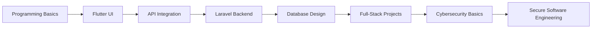

<p align="center">
  
</p>

<p align="center">
  
</p>

<p align="center">
  <a href="https://git.io/typing-svg">
    
  </a>
</p>

<p align="center">
  
  
  
</p>

<br>

<div align="center">

```txt
╔══════════════════════════════════════════════════════════════╗
║                                                              ║
║   🚀  SYSTEM ONLINE: EZZALDIN CYBER SPACE                    ║
║   ⚡  MODE: Flutter + Laravel + Cybersecurity                ║
║   🧠  MISSION: Turning ideas into powerful digital systems   ║
║   🔥  STATUS: Learning deeply. Building consistently.        ║
║                                                              ║
╚══════════════════════════════════════════════════════════════╝
```

</div>

---

<p align="center">
  
</p>

## 🌌 About Me

<table>
<tr>
<td width="60%">

### 👋 Hi, I’m **Ezzaldin Almansoub**

I am a **Software Engineering Student** focused on building real-world systems using:

- 📱 **Flutter** for modern mobile applications  
- 🔥 **Laravel** for backend systems and REST APIs  
- 🗄 **MySQL / SQLite** for database design  
- 🛡 **Cybersecurity fundamentals** for safer software  
- 🧠 **Software analysis and system design** for clean project structure  

I enjoy transforming simple ideas into useful, beautiful, and well-organized digital products.

</td>
<td width="40%" align="center">


</td>
</tr>
</table>

---

<p align="center">
  
</p>

## ⚡ Core Tech Universe

<div align="center">

<table>
<tr>
<td align="center" width="33%">

### 📱 Mobile Galaxy


<br><br>


<br>


<br><br>

```txt
UI / UX
API Integration
State Management
Responsive Design
```

</td>

<td align="center" width="33%">

### 🔥 Backend Core


<br><br>


<br>


<br><br>

```txt
REST APIs
MVC Architecture
Authentication
Database Relations
```

</td>

<td align="center" width="33%">

### 🛡 Cyber Zone


<br><br>


<br>


<br><br>

```txt
Security Basics
Secure Coding
Vulnerability Analysis
Ethical Learning
```

</td>
</tr>
</table>

</div>

---

## 🧬 My Digital DNA

<p align="center">
  
</p>

<div align="center">

| 🧠 Mindset | ⚡ Practice | 🚀 Goal |
|---|---|---|
| Deep Learning | Daily Coding | Real Projects |
| Problem Solving | Clean Structure | Strong Portfolio |
| System Thinking | API Building | Full-Stack Growth |
| Cyber Awareness | Secure Coding | Safer Applications |

</div>

---

<p align="center">
  
</p>

## 🚀 Live Projects Command Center

<table>
<tr>
<td width="50%">

<p align="center">
  
</p>

```yaml
Project: E-Learning Platform
Type: Graduation Year Project
Architecture: Full-Stack MVC System
Backend: Laravel / PHP
Database: MySQL / SQLite
Status: In Development 🚀

Modules:
  - Course Management
  - Student Dashboard
  - Admin Dashboard
  - Authentication
  - Lessons System
  - Clean MVC Structure
```

</td>

<td width="50%">

<p align="center">
  
</p>

```yaml
Project: ServiceHub App
Type: Mobile + Backend System
Frontend: Flutter
Backend: Laravel REST API
Database: MySQL
Status: Active Development ⚡

Modules:
  - Categories
  - Services
  - Providers
  - Bookings
  - API Integration
  - Modern UI Screens
```

</td>
</tr>
</table>

---

## 🛠 Arsenal of Tools

<div align="center">


</div>

<br>

<div align="center">


</div>

---

<p align="center">
  
</p>

## 🧭 Learning Roadmap



---

## 📊 GitHub Analytics Zone

<div align="center">


</div>

<br>

<div align="center">


</div>

<br>

<div align="center">


</div>

---

## 🏆 Achievement Terminal

<div align="center">


</div>

---

## 🧠 Developer Philosophy

<div align="center">

```txt
I do not chase code.
I chase understanding.

I do not build screens only.
I build experiences.

I do not study technology randomly.
I build my future step by step.
```

</div>

<p align="center">
  
</p>

---

## 🌐 Connect With Me

<div align="center">

<a href="mailto:your-email@example.com">
  
</a>

<a href="https://github.com/EzzaldinAlmansoub">
  
</a>

<a href="https://www.linkedin.com/in/your-linkedin">
  
</a>

</div>

---

<p align="center">
  
</p>
