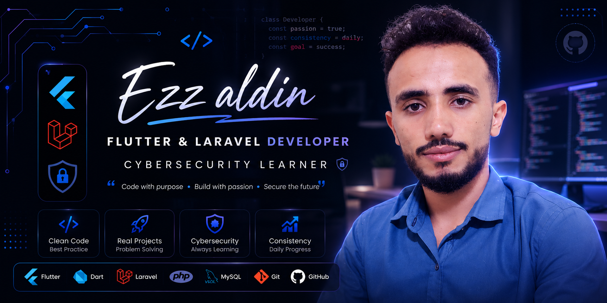

  

---

<h1 align="center">👋 مرحباً بك في عالمي البرمجي، أنا عز الدين!</h1>

  <strong>مطور تطبيقات فلاتر ومواقع لارافيل | مهتم وباحث في مجال الأمن السيبراني</strong>

  
  
  
  
  

---

## 🚀 نبذة عني (About Me)

> 💡 **"اكتب الكود بهدف، ابنِ بشغف، وأمّن المستقبل."**

أنا مطور برمجيات شغوف، أركز على بناء تطبيقات هاتف متكاملة وذكية باستخدام **Flutter**، وتطوير أنظمة خلفية (Backend) قوية ومستقرة باستخدام **Laravel**. بجانب التطوير، أمتلك شغفاً كبيراً بـ **الأمن السيبراني** وتأمين البيانات، وأسعى دائماً لتطبيق أفضل الممارسات الأمنية وكتابة (Clean Code).

---

## 🛠️ الحقيبة التقنية (My Tech Stack)

| المجال | التقنيات والأدوات |
| :--- | :--- |
| **تطوير الهواتف (Mobile)** |   |
| **تطوير الويب (Backend)** |   |
| **قواعد البيانات (Databases)** |   |
| **أدوات التحكم والبيئة** |    |
| **الأمن السيبراني (Cybersecurity)** |   |

---

## 📊 إحصائيات GitHub (My GitHub Stats)

  
  

---

## 🎯 الأهداف الحالية (Current Focus)

* 🎓 إتمام مشروع التخرج الأكاديمي (منصة تعليمية متكاملة / أو مشروع أمني متقدم).
* 🔒 تعميق المعرفة في هندسة البرمجيات الآمنة (Secure Software Development Lifecycle).
* 📱 بناء تطبيقات بـ Flutter تعتمد على معمارية نظيفة (Clean Architecture).

---

## 🤝 تواصل معي (Connect with Me)

  
  

🎯 شكراً لزيارة ملفي الشخصي! لا تتردد في استكشاف مستودعاتي (Repositories) أو مراسلتي لبناء شيء رائع معاً. 🚀

