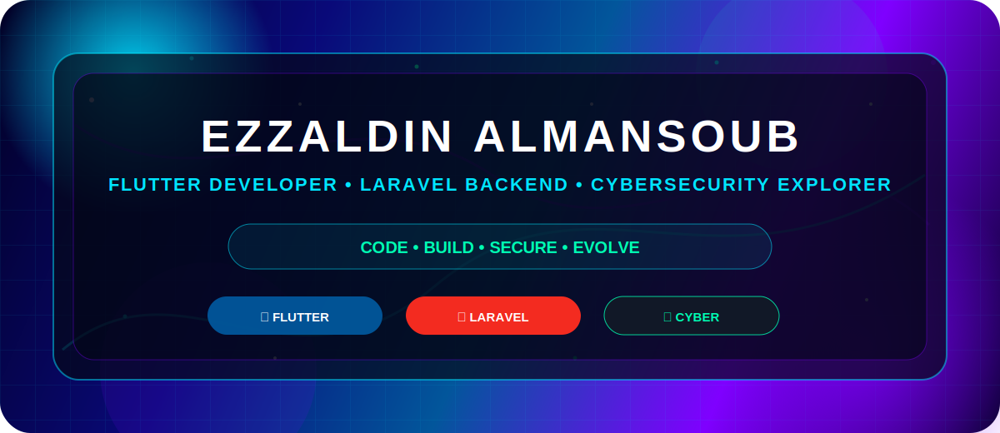

<p align="center">
  
</p>

<p align="center">
  <a href="https://git.io/typing-svg">
    
  </a>
</p>

<p align="center">
  
  
  
</p>

<p align="center">
  
  
</p>

---

<p align="center">
  
</p>

<h2 align="center">🧠 IDENTITY CORE</h2>

<p align="center">
  
</p>

<p align="center">
  
</p>

<h3 align="center">Hi, I’m Ezzaldin Almansoub 👋</h3>

<p align="center">
  I am a Software Engineering Student building my path in modern software development.
  <br>
  I focus on Flutter, Laravel, databases, system analysis, and cybersecurity fundamentals.
  <br>
  My goal is to build useful, beautiful, secure, and well-structured digital products.
</p>

<p align="center">
  
  
  
</p>

---

<p align="center">
  
</p>

<h2 align="center">⚡ Tech Power Universe</h2>

<h3 align="center">📱 Mobile Dimension</h3>

<p align="center">
  
</p>

<p align="center">
  
  
</p>

<p align="center">
  Modern UI • Responsive Screens • API Integration • State Management • Cross-Platform Apps
</p>

<br>

<h3 align="center">🔥 Backend Engine</h3>

<p align="center">
  
</p>

<p align="center">
  
  
  
</p>

<p align="center">
  MVC Architecture • REST APIs • Authentication • Database Relations • Admin Dashboards
</p>

<br>

<h3 align="center">🛡 Cyber Layer</h3>

<p align="center">
  
</p>

<p align="center">
  
  
  
</p>

<p align="center">
  Security Basics • Secure Coding • Vulnerability Analysis • Digital Defense • Ethical Learning
</p>

---

<p align="center">
  
</p>

<h2 align="center">🚀 PROJECT COMMAND DECK</h2>

<p align="center">
  
</p>

```yaml
Project_Name: E-Learning Platform
Project_Type: Graduation Year Project
Architecture: Full-Stack MVC System
Backend: Laravel / PHP
Database: MySQL / SQLite
Status: In Development

Main_Modules:
  - Course Management
  - Lessons Management
  - Student Dashboard
  - Admin Dashboard
  - Authentication System
  - Clean MVC Structure

Engineering_Goal:
  - Build a complete educational platform
  - Apply software engineering concepts
  - Create a practical graduation-level system

<p align="center">
  
</p>Project_Name: ServiceHub App
Project_Type: Mobile + Backend System
Frontend: Flutter
Backend: Laravel REST API
Database: MySQL
Status: Active Development

Main_Modules:
  - Categories
  - Services
  - Providers
  - Bookings
  - API Integration
  - Modern Mobile Screens

Engineering_Goal:
  - Build an API-driven mobile app
  - Practice real full-stack workflow
  - Connect users with service providers

---

<p align="center">
  
</p><h2 align="center">🧬 Developer DNA Matrix</h2><p align="center">
  
  
  
  
  
  
</p><p align="center">
  
</p>---

<h2 align="center">🛠 Ultimate Technology Arsenal</h2><p align="center">
  
</p><p align="center">
  
  
  
  
  
</p>---

<p align="center">
  
</p><h2 align="center">🧭 Growth Map</h2>flowchart TD
    A[Programming Fundamentals] --> B[Flutter UI]
    B --> C[API Integration]
    C --> D[Laravel Backend]
    D --> E[Database Design]
    E --> F[Full Stack Projects]
    F --> G[Cybersecurity Basics]
    G --> H[Secure Software Engineering]
    H --> I[Professional Portfolio]

---

<p align="center">
  
</p><h2 align="center">📊 GitHub Intelligence Center</h2><p align="center">
  
</p><p align="center">
  
</p><p align="center">
  
</p><p align="center">
  
</p><p align="center">
  
</p><p align="center">
  
</p>---

<p align="center">
  
</p><h2 align="center">💎 Developer Philosophy</h2><p align="center">
  
</p>Every project makes me stronger.
Every bug teaches me something.
Every day is a new upgrade.

Code is not just syntax.
Code is thinking, design, logic, patience, and vision.

---

<h2 align="center">🌐 Contact Portal</h2><p align="center">
  <a href="mailto:your-email@example.com">
    
  </a>
  <a href="https://github.com/EzzaldinAlmansoub">
    
  </a>
  <a href="https://www.linkedin.com/in/your-linkedin">
    
  </a>
</p><p align="center">
  
</p>
```
